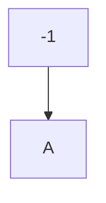

## heading1
## heading2
killer boy sacin 
=================

with - heading
---------------

Speacila Styles

**BOLD**
__Bold__
*italic*
_italic_
~~strocke through~~

git hub flavour MArkdown GFM [^1]

> quotation
***
- value1
- value2

1. first no.
   * value
1. second number

[google](https://google.com)  
[wikipedia][1]

[1]: https://wiki.org

# Github GFM -> github flavour markdown 
[^1]: my refrence -- footnote1

TABLES
| left | center | right
| ---- | :------:| -----:
|value1 | value2 | value3

TASK LIST 
--------
- [x] first
  - [x] one
  - [ ] two
- [ ] doen

  
 values 
  

  nhbdlgndrugnernglnsgrt

# emojis
😄🫰
Alert Syntax
>[!Note]
>[!Warn]
>[!BUg]
>

